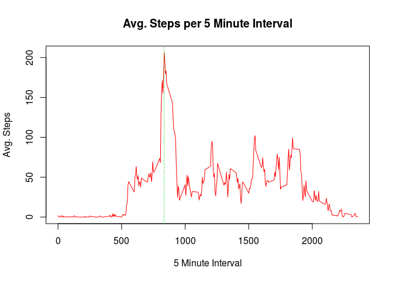
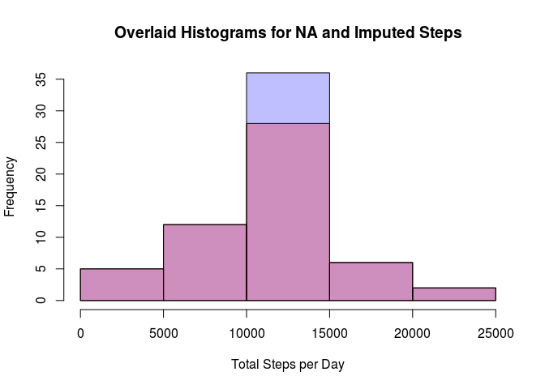

# Reproducible Research: Peer Assessment 1


```r
library(lubridate)
library(dplyr)
```

```
## 
## Attaching package: 'dplyr'
## 
## The following objects are masked from 'package:lubridate':
## 
##     intersect, setdiff, union
## 
## The following objects are masked from 'package:stats':
## 
##     filter, lag
## 
## The following objects are masked from 'package:base':
## 
##     intersect, setdiff, setequal, union
```

```r
library(lattice)
```

## Loading and preprocessing the data

```r
data <- read.csv("activity.csv")
data$date <- ymd(data$date)
```

## What is mean total number of steps taken per day?

```r
data_wo_na <- data[complete.cases(data),]
steps_by_day <-
  data_wo_na %>%
  group_by(date) %>%
  summarize(steps = sum(steps))
hist(steps_by_day$steps, main="Histogram of Total Steps per Day", xlab="Total Steps per Day")
```

 

Mean of the total number of steps per day

```r
mean(steps_by_day$steps)
```

```
## [1] 10766
```

Median of the total number of steps per day

```r
median(steps_by_day$steps)
```

```
## [1] 10765
```

## What is the average daily activity pattern?

```r
avg_by_interval <-
  data_wo_na %>%
  group_by(interval) %>%
  summarize(steps = mean(steps))

plot(avg_by_interval$interval,avg_by_interval$steps,type="l",col="red", xlab="5 Minute Interval", ylab = "Avg. Steps", main = "Avg. Steps per 5 Minute Interval")
abline(v=avg_by_interval[which.max(avg_by_interval$steps),]$interval,col=3,lty=3)
```

 

5 minute interval averaged over all days containing the largest number of steps

```r
avg_by_interval[which.max(avg_by_interval$steps),]$interval
```

```
## [1] 835
```

## Imputing missing values

```r
names(avg_by_interval)[2] <- "interval_avg"
data_filled <- merge(data,avg_by_interval,by="interval")
data_filled <- arrange(data_filled, date, interval)

data_filled$steps_filled <- data_filled$steps
data_filled$steps_filled[is.na(data_filled$steps)] <- data_filled$interval_avg[is.na(data_filled$steps)]

steps_by_filled_day <-
  data_filled %>%
  group_by(date) %>%
  summarize(steps = sum(steps_filled))
p1 <- hist(steps_by_day$steps)
p2 <- hist(steps_by_filled_day$steps)
```


```r
plot( p2, col=rgb(0,0,1,1/4), xlab="Total Steps per Day", main="Overlaid Histograms for NA and Imputed Steps")
plot( p1, col=rgb(1,0,0,1/4), add=T, xlab="")
```

 

The above plot overlays the two histograms for NA (transparaent red) and imputed missing (transparaent blue) values. The bar with the top blue area shows that all of the imputed values were added to days near the total steps per day mean.

## Are there differences in activity patterns between weekdays and weekends?

```r
data_filled$day <- 'weekday'
data_filled$day[weekdays(data_filled$date) == 'Sunday'] <- 'weekend'
data_filled$day[weekdays(data_filled$date) == 'Saturday'] <- 'weekend'

avg_by_day_type <-
  data_filled %>%
  group_by(interval,day) %>%
  summarize(steps = mean(steps_filled))

xyplot(steps ~ interval | day, data = avg_by_day_type, layout = c(1,2), type="l")
```

 
